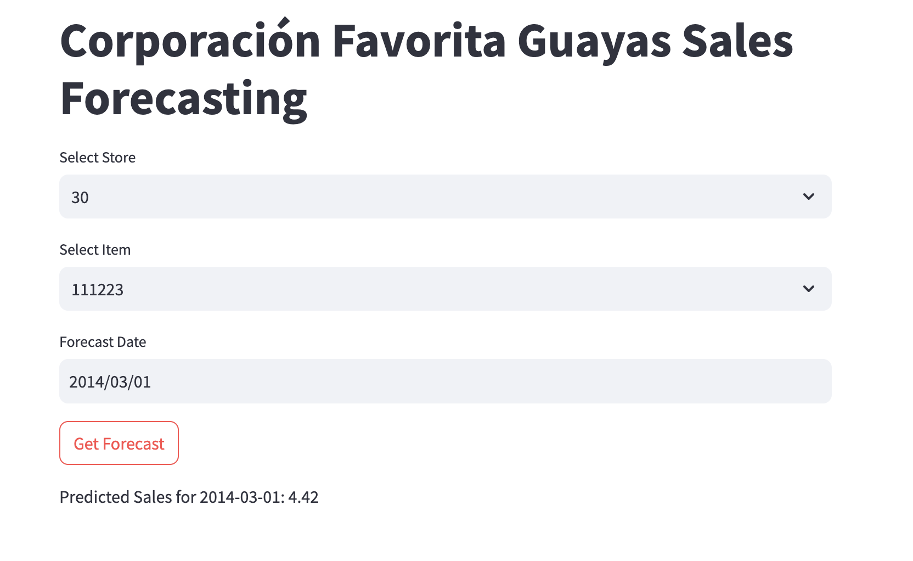
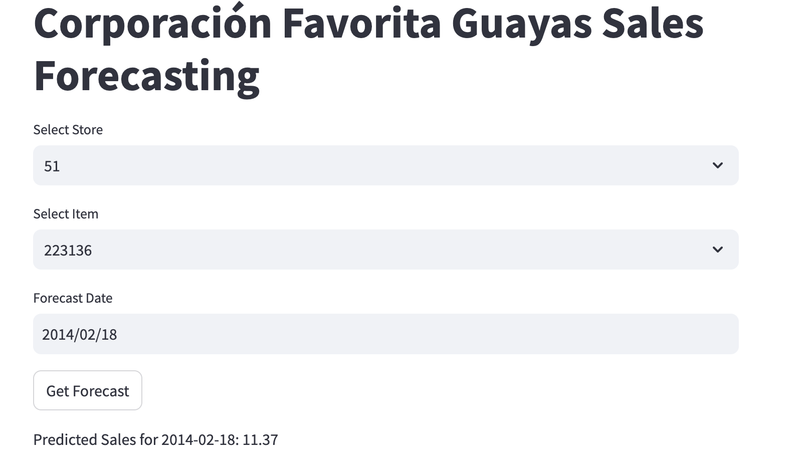

# 📊 Corporación Favorita Guayas Sales Forecasting  

This project aims to develop a **machine learning-based sales forecasting model** 
for different products across stores in the Guayas region. 
The predictions are visualized using a **Streamlit web application**,
which allows users to select a store, item and date to obtain sales forecasts.  

## 🚀 Project Overview  

Throughout this project, I:  
- Conducted **exploratory data analysis (EDA)** to understand sales trends.  
- Preprocessed data, including handling missing values and feature engineering.  
- Developed a **forecasting model** to predict sales for January–March 2014.  
- Built a **Streamlit application** for demand planners to interact with forecasts.  

## 🔍 Data Preprocessing  

- Filled missing dates with **zero sales** to ensure a continuous time series.  
- Created **lag features** for trend analysis.  
- Dropped rows with `NaN` values post-feature engineering.  
- Merged data at the end of preprocessing to ensure consistency.  

## 🤖 Model Choice & Justification  

I tested different models and selected  **machine learning model**  XGBoost
for its best result and ability to capture complex patterns and interactions 
within the data.

### **Model Performance**

**Evaluation Metrics:**

- **RMSE (Root Mean Square Error):** The RMSE for the model is **7.74**.  
  This metric indicates that, on average, the model's predictions deviate from the actual sales by 7.74 units. A lower RMSE reflects better model accuracy.

- **MAE (Mean Absolute Error):** The MAE for the model is **3.07**.  
  This metric measures the average magnitude of the errors in a set of predictions, without considering their direction. It provides a more direct interpretation of how far off the predictions are, with smaller MAE values indicating better performance.

## 🌍 Streamlit Web Application  

My Streamlit app allows users to:  
- **Select a store and item** to forecast.  
- **Pick a date** within the prediction range.  
- **Generate sales predictions** interactively. 

### **App Screenshots**

1. **Store 30, Item 111223 - Forecast for 2014-03-01**  
   Predicted Sales for **2014-03-01**: **4.42**  
 
   

2. **Store 51, Item 223136 - Forecast for 2014-02-18**  
   Predicted Sales for **2014-02-18**: **11.37**  
 
   

